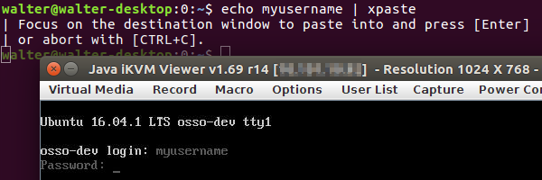

xpaste - paste text into X windows that don't work with selections
==================================================================

.. image:: https://bettercodehub.com/edge/badge/ossobv/xpaste

SYNOPSIS
--------

::

    xpaste <<EOF
    This text will be pasted into a window of your choosing.
    EOF

DESCRIPTION
-----------

*Some applications refuse to work with any of the three selection
buffers that X/X11/Xorg has: the* **middle-mouse** *selection,*
**secondary** *selection and the* **CTRL-(SHIFT-)V** *clipboard
selection.*

If you have to insert long or difficult to type text (generated
passwords), not being able to *paste* can be troublesome.

xpaste will read the text to paste from standard input, keep it in
memory and wait for you to press ENTER.  When you do, it pastes the held
text into the newly focused window.

See this *before/after* example where the username is pasted into the
SuperMicro ipmiview Java application that doesn't accept "paste" input
through the middle-mouse or CTRL-V:

The pasting of text happens through "faked" keypress events.  And as you
can see from the example, it works.

**NOTE: xpaste now works with Wayland as well: it uses /dev/uinput to
attach a virtual keyboard.**

COPYRIGHT
---------

Copyright (C) 2016,2018,2020,2022  Walter Doekes, OSSO B.V.

This program is free software: you can redistribute it and/or modify
it under the terms of the GNU General Public License as published by
the Free Software Foundation, either version 3 of the License, or
(at your option) any later version.

SEE ALSO
--------

xsel(1), crikey(1)
